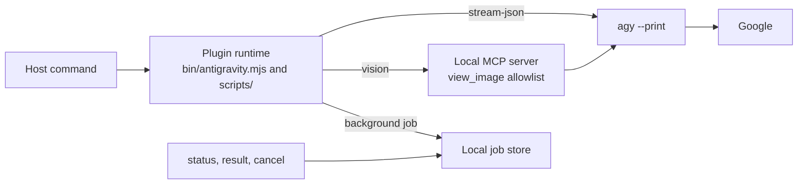

<div align="center">

# antigravity-plugin

Delegate code reviews, fixes, and screenshot analysis to Google's Antigravity CLI from Claude Code, Codex CLI, agy, or your shell.

[npm](https://www.npmjs.com/package/@southcarpet/antigravity-plugin) · [Releases](https://github.com/SouthCarpet/antigravity-plugin/releases) · [Changelog](./CHANGELOG.md) · [Commands](./docs/COMMANDS.md) · [Security](./SECURITY.md)

[](https://www.npmjs.com/package/@southcarpet/antigravity-plugin)
[](https://github.com/SouthCarpet/antigravity-plugin/actions/workflows/ci.yml)
[](https://github.com/SouthCarpet/antigravity-plugin/releases)
[](./LICENSE)
[](./package.json)
[](https://github.com/SouthCarpet/antigravity-plugin/issues?q=is%3Aissue+is%3Aopen+label%3A%22known+issue%22)

</div>

## What it is

This plugin starts `agy --print` from the host that you already use. It gives Claude Code, Codex CLI, agy, and the standalone CLI the same eight verbs, has no runtime dependencies, and publishes releases through npm trusted publishing with a provenance attestation and SSH-signed tags. It is a maintained fork of [sakibsadmanshajib/antigravity-plugin](https://github.com/sakibsadmanshajib/antigravity-plugin), with credit to the original author for the plugin architecture. It replaces the archived [`gemini-plugin-cc`](https://github.com/sakibsadmanshajib/gemini-plugin-cc) because Google [retires Gemini CLI on June 18, 2026](https://developers.googleblog.com/an-important-update-transitioning-gemini-cli-to-antigravity-cli/) for free and personal users.

## Status

> **v1.1.0.** The eight verbs, their flags, exit codes, `--json` envelope,
> state locations, and supported hosts are frozen for 1.x; breaking them
> needs 2.0.0. That contract is in [`docs/COMPATIBILITY.md`](./docs/COMPATIBILITY.md).
> This does not mean finished — it means the surface stops moving. See
> [`CHANGELOG.md`](./CHANGELOG.md).

Plugin 1.1.0 is this package's version number. agy 1.1.15, 1.1.17, and
1.1.24 are versions of Google's Antigravity CLI. The two version lines
advance independently. A new agy release does not change the plugin version.

Plugin 1.1.0 is tested with agy 1.1.15, 1.1.17, and 1.1.24. See
[`docs/COMPATIBILITY.md`](./docs/COMPATIBILITY.md) for behavior that differs
by agy version. The plugin does not update itself.

## Why this plugin

- **Detect denied headless tools.** Since agy 1.1.20, a denied tool can return `SUCCESS` with an empty answer, so the runtime changes this result to a failure that names the tool.
- **Send real image input.** A local MCP server delivers pixels, including the offloaded-copy path used by agy 1.1.24.
- **Use one command set.** The same eight verbs run on Claude Code, Codex CLI, agy, and the standalone CLI.
- **Control background jobs.** Use `status`, `result`, and `cancel` to inspect, retrieve, or stop jobs.
- **Grant bounded reads.** `--add-dir` gives `rescue` and `task` a per-run read grant for the named directory.
- **Verify releases.** npm provenance and signed tags connect a package to its source commit.
- **Keep the runtime small.** The package has zero runtime dependencies and a suite of 487 tests on Linux and Windows.

## Quick start

### Claude Code

```bash
claude plugin marketplace add SouthCarpet/antigravity-plugin
claude plugin install antigravity@antigravity
/antigravity:setup
/antigravity:review
```

### Codex CLI

```bash
codex plugin marketplace add <path-to-clone>
codex plugin add antigravity@antigravity
$antigravity setup
$antigravity review
```

### agy

```bash
git clone https://github.com/SouthCarpet/antigravity-plugin.git
agy plugin install <path-to-clone>
# In the agy TUI:
/antigravity:<verb>
```

### Standalone

```bash
# Run from any shell:
npx @southcarpet/antigravity-plugin setup
npx @southcarpet/antigravity-plugin review
```

## How it works



The runtime sends prompts, selected diffs, and named image bytes through agy to Google. Background job requests, results, and logs stay in the local job store. The plugin does not create persistent wildcard grants. `setup` writes only user-level files under `~/.gemini`, not the current repository.

## Commands

| Verb | Purpose |
|---|---|
| `setup` | Run the agy OAuth probe and configure or remove the vision channel. |
| `review` | Review a working-tree or branch diff. |
| `rescue` | Delegate a prompt in a fresh or resumed conversation. |
| `task` | Run a delegated prompt, in the background by default. |
| `vision` | Analyze one or more named image files. |
| `status` | List jobs or inspect and wait for one job. |
| `result` | Read the stored result for a job. |
| `cancel` | Stop a queued or running job. |

`update` is a standalone convenience command. It is not one of the eight verbs. See [Commands reference](./docs/COMMANDS.md) for flags and exit codes.

## Vision

`agy --print` has no native image input. The local MCP server delivers the pixels. On agy 1.1.24, agy can offload a large result to a copy, and the prompt opens exactly that copy with `view_file`.

The requested answer has `Transcription`, `Observations`, and `Answer` sections. If the channel cannot deliver visual content, the answer is `VISION-UNAVAILABLE: <reason>`. An answer from this channel is not evidence. The cross-checked transcript is the evidence.

```bash
npx @southcarpet/antigravity-plugin vision ./screenshot.png --prompt "Which text is visible?"
```

See [Commands reference](./docs/COMMANDS.md#vision) for formats, limits, flags, and the measured model guidance.

## Updating

For the standalone CLI, use an unversioned `npx @southcarpet/antigravity-plugin <command>` invocation to resolve the latest published version. A pinned version does not update.

For Claude Code, run `claude plugin update antigravity@antigravity`, then restart Claude Code. Codex CLI has no plugin update command. Run `codex plugin remove antigravity@antigravity`, then `codex plugin add antigravity@antigravity`.

For agy, run `agy plugin uninstall antigravity`, then `agy plugin install <path-to-clean-clone>`. A plain reinstall merges with the old copy.

`antigravity-plugin update` checks the registry and reports the host commands. `antigravity-plugin update --apply` runs those commands for detected hosts. Set `ANTIGRAVITY_NO_UPDATE_CHECK=1` to skip the registry check.

## Requirements

- Node.js `>= 22.3.0`.
- agy 1.1.15, 1.1.17, or 1.1.24 on `PATH`. These versions form the tested matrix.
- A Google account for agy OAuth.

## Permissions and privacy

`setup` changes user-level files under `~/.gemini`. After a successful OAuth probe, it registers `mcpServers.vision` and the `mcp(vision/view_image)` allow rule. Each `vision` run allows only the image paths that you name. The server denies every other path and denies all access when no per-run allowlist is present.

Undo the vision configuration without changing OAuth or job state:

```bash
# Host commands
/antigravity:setup --remove-vision
$antigravity setup --remove-vision

# Standalone command
npx @southcarpet/antigravity-plugin setup --remove-vision
```

What each verb sends:

| Verb | What leaves this machine |
|---|---|
| `setup` | Google OAuth via `agy`. The plugin itself only writes `~/.gemini`. |
| `review` | The collected git diff, untracked snippets, and review prompt go through `agy` to Google. |
| `rescue` / `task` | Your prompt goes through `agy` to Google. agy can also read workspace files and `--add-dir` roots with its own tools. |
| `vision` | Your prompt and the bytes of the named images go through the local MCP server and `agy`. |
| `status` / `result` / `cancel` | Nothing. These verbs only read or signal local job state. |

Delegation is like pasting the content into a Google product. Secrets in diffs, prompts, or screenshots are sent. Delegation also costs tokens on the Google side. When agy reports measured use, stderr contains `usage: total=<N> in=<N> out=<N>`.

See [Security](./SECURITY.md) for threat boundaries and vulnerability reports.

## Release integrity

npmjs.org is the primary registry. Releases use npm trusted publishing and include a provenance attestation. Release tags use SSH signatures from v1.1.0 onward.

Check the attestation:

```bash
npm view @southcarpet/antigravity-plugin@<version> dist.attestations
```

Check the registry signature and attestation in a fresh install:

```bash
mkdir verify && cd verify
npm init -y
npm install @southcarpet/antigravity-plugin@<version>
npm audit signatures
```

GitHub Packages mirrors the same tarball with `--provenance=false`. It exists for discovery on the repository page and needs a token to install, even for this public package.

## Documentation

- [Installation](./docs/INSTALL.md): per-host setup recipes.
- [1.x compatibility contract](./docs/COMPATIBILITY.md): supported matrix, outputs, state, and versioning promises.
- [Commands reference](./docs/COMMANDS.md): all eight verbs, flags, defaults, and exit behavior.
- [Security](./SECURITY.md): reporting channel, scope, and what leaves the machine.
- [Release smoke checklist](./docs/SMOKE.md): four-host pre-release pass.
- [Spike findings](./docs/SPIKE-findings.md): why the project does not use ACP.
- [Release runbook](./docs/RELEASING.md): trusted publishing, signed tags, and verification.

## Contributing

Open an issue before you propose a behavior change. Every pull request runs the four gates on Ubuntu and Windows with Node 22.3 and Node 24. The tests use `node:test` with owned seams. The 1.x contract in [Compatibility](./docs/COMPATIBILITY.md) is frozen.

```bash
node --test --experimental-test-module-mocks tests/*.test.mjs
node scripts/check-manifests.mjs
node scripts/check-pack.mjs
node scripts/bump-version.mjs --check
```

The package has no dependencies and no lockfile. The pack gate checks the files that all four hosts need.

## Known issues

All previously tracked items, including [#5](https://github.com/SouthCarpet/antigravity-plugin/issues/5), are fixed. New items use the [`known issue` label](https://github.com/SouthCarpet/antigravity-plugin/issues?q=is%3Aissue+is%3Aopen+label%3A%22known+issue%22).

## Acknowledgements and license

This project is a maintained fork of [sakibsadmanshajib/antigravity-plugin](https://github.com/sakibsadmanshajib/antigravity-plugin). Credit goes to the original author for the plugin architecture. The project replaces the archived [`gemini-plugin-cc`](https://github.com/sakibsadmanshajib/gemini-plugin-cc) after Google's Gemini CLI retirement notice for free and personal users.

The code uses the MIT License. See [`LICENSE`](./LICENSE). Antigravity and Gemini are Google's trademarks. Claude Code is Anthropic's trademark. Codex is OpenAI's trademark. This project is not affiliated with or endorsed by these companies.
