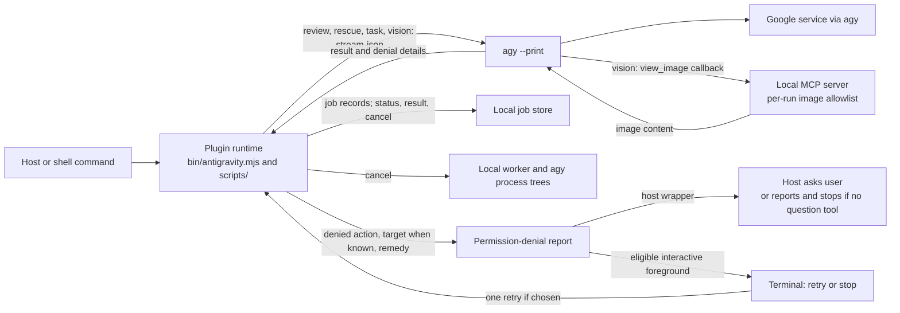

<div align="center">

# antigravity-plugin

Delegate code reviews, fixes, and screenshot analysis to Google's Antigravity CLI from Claude Code, Codex CLI, agy, or your shell.

[npm](https://www.npmjs.com/package/@southcarpet/antigravity-plugin) · [Releases](https://github.com/SouthCarpet/antigravity-plugin/releases) · [Changelog](./CHANGELOG.md) · [Commands](./docs/COMMANDS.md) · [Security](./SECURITY.md)

[](https://www.npmjs.com/package/@southcarpet/antigravity-plugin)
[](https://github.com/SouthCarpet/antigravity-plugin/actions/workflows/ci.yml)
[](https://github.com/SouthCarpet/antigravity-plugin/releases)
[](./LICENSE)
[](./package.json)
[](https://github.com/SouthCarpet/antigravity-plugin/issues?q=is%3Aissue+is%3Aopen+label%3A%22known+issue%22)
[](https://socket.dev/npm/package/@southcarpet/antigravity-plugin/overview/)

</div>

## What it is

This plugin starts `agy --print` from the host that you already use. It gives Claude Code, Codex CLI, agy, and the standalone CLI the same nine verbs. You can review a diff, run a delegated prompt, analyze named images, and inspect or stop a background job from that host.

## Installation and quick start

### Claude Code

```bash
claude plugin marketplace add SouthCarpet/antigravity-plugin
claude plugin install antigravity@antigravity
/antigravity:setup
/antigravity:review
```

### Codex CLI

```bash
codex plugin marketplace add <path-to-clone>
codex plugin add antigravity@antigravity
$antigravity setup
$antigravity review
```

### agy

```bash
git clone https://github.com/SouthCarpet/antigravity-plugin.git
agy plugin install <path-to-clone>
# In the agy TUI:
/antigravity:<verb>
```

### Standalone

```bash
# Run from any shell:
npx @southcarpet/antigravity-plugin setup
npx @southcarpet/antigravity-plugin doctor
npx @southcarpet/antigravity-plugin review
```

If a command fails, see [Troubleshooting](./docs/INSTALL.md#troubleshooting).

## Status

> **v2.1.0.** From 3.0.0 forward, while the first number of this version
> stays 3, an update does not break a command or an output that already
> works. If a command, flag, exit code, `--json` envelope, state location,
> or supported host is removed, release notes and documentation first mark
> it deprecated. It then stays for at least one more release that still
> starts with 3. It is removed only in version 4.0.0. That contract is in
> [`docs/COMPATIBILITY.md`](./docs/COMPATIBILITY.md). Version 3.0.0 is a
> major release because one default changed: `vision` now uses
> `gemini-3.8-flash-high`, not `gemini-3.6-flash-high`. Pass
> `--model gemini-3.6-flash-high` to keep the old model. See
> [`CHANGELOG.md`](./CHANGELOG.md).

Plugin 2.1.0 is this package's version number. agy is Google's Antigravity
CLI. The two version lines advance independently. A new agy release does
not change the plugin version.

Plugin 2.1.0 is tested with agy 1.1.15 to 1.3.1; newest measured 1.3.1. See
[`docs/COMPATIBILITY.md`](./docs/COMPATIBILITY.md) for the per-version table.
The plugin does not update itself.

## Why this plugin

- **One command set on every host.** The same nine verbs run on Claude Code, Codex CLI, agy, and the standalone CLI.
- **Clear failures instead of empty answers.** When agy denies a tool in headless mode, the plugin fails the run, names the tool, and gives one remedy.
- **Real image input.** `vision` sends pixels to agy through a local MCP server, and `--expect` checks the transcription for text you name.
- **Reviews you can check.** `review` can preview its input, refuse an incomplete input, return schema-checked findings, and check where its citations land in the diff.
- **Background jobs under control.** `status`, `result`, and `cancel` manage jobs, `--wait --show-result` returns the finished answer in one call, and `--request-id` stops a double dispatch.
- **Predictable runs.** `task` and `rescue` have a default effort, agy gets a time budget that it also enforces, slash text in a prompt stays text, and every job records its provenance.
- **Output for scripts.** `--json` writes one envelope, also for expected failures, and a usage line goes to stderr.
- **Small and verifiable.** The package has zero runtime dependencies, `doctor` is read-only, CI runs on three systems, and releases carry npm provenance and signed tags.

Flags, defaults, and exit codes are in the [Commands reference](./docs/COMMANDS.md). Measured limits and promises are in [Compatibility](./docs/COMPATIBILITY.md). What leaves your machine is in [Permissions and privacy](#permissions-and-privacy).

## How it works


```mermaid
flowchart LR
    Host["Host or shell command"] --> Runtime["Plugin runtime<br/>bin/antigravity.mjs and scripts/"]
    Runtime -->|"review, rescue, task, vision: stream-json"| Agy["agy --print"]
    Agy --> Google["Google service via agy"]
    Agy -->|"vision: view_image callback"| MCP["Local MCP server<br/>per-run image allowlist"]
    MCP -->|"image content"| Agy
    Agy -->|"result and denial details"| Runtime
    Runtime -->|"job records; status, result, cancel"| Store["Local job store"]
    Runtime -->|"cancel"| Processes["Local worker and agy process trees"]
    Runtime -->|"denied action, target when known, remedy"| Denial["Permission-denial report"]
    Denial -->|"host wrapper"| HostChoice["Host asks user<br/>or reports and stops if no question tool"]
    Denial -->|"eligible interactive foreground"| TerminalChoice["Terminal: retry or stop"]
    TerminalChoice -->|"one retry if chosen"| Runtime
```

`setup` configures agy to launch the local vision MCP server. Each `vision`
run supplies an image allowlist; agy calls `view_image` and receives image
content. If agy offloads that content, the prompt opens only the exact copy
with `view_file`. Prompts, selected diffs, image bytes, and files read by agy's
own tools can reach its service. Job records stay local; `status`, `result`
and `cancel` do not call the model service.

A denied run reports the action, its target when known, and a remedy. Empty
answers with denial evidence fail; answers with denied actions carry a warning.
The host asks the user what to do, or reports and stops if it has no question
tool. An eligible interactive foreground run can offer one retry of the same
conversation. The plugin never grants the denied action or prints a bypass
flag. `setup` writes user-level files under `~/.gemini`, not the repository.

## Commands

| Verb | Purpose |
|---|---|
| `setup` | Run the agy OAuth probe and configure or remove the vision channel. |
| `review` | Review a working-tree or branch diff. |
| `rescue` | Delegate a prompt in a fresh or resumed conversation. |
| `task` | Run a delegated prompt, in the background by default. |
| `vision` | Analyze one or more named image files. |
| `status` | List jobs or inspect and wait for one job, optionally exiting by that job's own outcome (`--exit-status`). |
| `result` | Read the stored result for a job. |
| `cancel` | Stop a queued or running job. |
| `doctor` | Read-only environment and configuration check. No OAuth, no model call, no write, no network. |

`update` is a standalone convenience command. It is not one of the nine verbs. See [Commands reference](./docs/COMMANDS.md) for flags and exit codes.

## Vision

`agy --print` has no native image input. The local MCP server delivers the pixels. On agy 1.1.24, agy can offload a large result to a copy, and the prompt opens exactly that copy with `view_file`.

The requested answer has `Transcription`, `Observations`, and `Answer` sections. If the channel cannot deliver visual content, the answer is `VISION-UNAVAILABLE: <reason>`. An answer from this channel is not evidence. The cross-checked transcript is the evidence.

```bash
npx @southcarpet/antigravity-plugin vision ./screenshot.png --prompt "Which text is visible?"
```

The default model is `gemini-3.8-flash-high`. Before 3.0.0 it was `gemini-3.6-flash-high`. See [Commands reference](./docs/COMMANDS.md#vision) for formats, limits, flags, and the measured model guidance.

## Updating

For the standalone CLI, use an unversioned `npx @southcarpet/antigravity-plugin <command>` invocation to resolve the latest published version. A pinned version does not update.

For Claude Code, run `claude plugin marketplace update antigravity` first, then `claude plugin update antigravity@antigravity`, then restart Claude Code. Without the marketplace refresh, `plugin update` reports the old version as the latest. Codex CLI has no plugin update command. Run `codex plugin remove antigravity@antigravity`, then `codex plugin add antigravity@antigravity`. Codex installs from the marketplace you registered: if that marketplace is a local clone, pull the clone first.

For agy, run `agy plugin uninstall antigravity`, then `agy plugin install <dir>` again on a fresh packed copy: `node scripts/pack-for-agy.mjs` from a checkout (or `npm pack @southcarpet/antigravity-plugin` plus a manual extract), then `agy plugin install` on the directory it prints. This ships exactly what `npm publish` ships; `agy plugin install` on a plain clone also copies `.git`, `.github`, and `tests/`, since it does not read `package.json` `files`. Before 1.1.28, agy merged a reinstall into the old copy. Since 1.1.28, `agy plugin install` replaces the managed directory exactly (`agy-changelog-1.2.7.txt`). Uninstall-then-install remains the safe path on every version. See [Installation](./docs/INSTALL.md#agy-itself) for the full recipe.

`antigravity-plugin update` checks the registry and reports the host commands. `antigravity-plugin update --apply` runs those commands for detected hosts. For Claude Code it refreshes the marketplace first. For Codex CLI it lists the marketplaces first: if the `antigravity` marketplace is a local clone, it prints the path and tells you to pull that clone, then after the install it prints the installed version and a warning when that version is not the latest. It never pulls or changes your clone. Set `ANTIGRAVITY_NO_UPDATE_CHECK=1` to skip the registry check. Run `update --apply` from a directory outside the agy install root. If you run it from inside that root, it moves to its own temporary directory and tells you, because a cwd inside the root can leave the uninstall step half-done.

## Requirements

- Node.js `>= 22.3.0`.
- agy 1.1.15 to 1.3.1 on `PATH`; newest measured 1.3.1. See [`docs/COMPATIBILITY.md`](./docs/COMPATIBILITY.md) for the per-version table.
- A Google account for agy OAuth.

## Permissions and privacy

`setup` changes user-level files under `~/.gemini`. After a successful OAuth probe, it registers `mcpServers.vision` and the `mcp(vision/view_image)` allow rule. Each `vision` run allows only the image paths that you name. The server denies every other path and denies all access when no per-run allowlist is present.

Headless verbs (`rescue`, `task`, `review`, `vision` run through a host wrapper or in the background) are read-and-reason, not read-and-write. Reads are granted per invocation with `--add-dir <dir>` (bounded to that directory, read-only, for that run); execution inside agy is all-or-nothing, since headless mode cannot prompt for a permission. A task that needs a command actually run must either grant everything up front (accepting that risk) or run the command yourself and hand the seat the output to judge.

Undo the vision configuration without changing OAuth or job state:

```bash
# Host commands
/antigravity:setup --remove-vision
$antigravity setup --remove-vision

# Standalone command
npx @southcarpet/antigravity-plugin setup --remove-vision
```

What each verb sends:

| Verb | What leaves this machine |
|---|---|
| `setup` | Google OAuth via `agy`. The plugin itself only writes `~/.gemini`. |
| `review` | The collected git diff, untracked snippets, and review prompt go through `agy` to Google. |
| `rescue` / `task` | Your prompt goes through `agy` to Google. agy can also read workspace files and `--add-dir` roots with its own tools. |
| `vision` | Your prompt and the bytes of the named images go through the local MCP server and `agy`. |
| `status` / `result` / `cancel` | Nothing. These verbs only read or signal local job state. |

Delegation is like pasting the content into a Google product. Secrets in diffs, prompts, or screenshots are sent. Delegation also costs tokens on the Google side. When agy reports measured use, stderr contains `usage: total=<N> in=<N> out=<N>`.

See [Security](./SECURITY.md) for threat boundaries and vulnerability reports.

## Release integrity

Socket scores the published package (the badge is at the top of this page). Its supply chain score counts the capabilities this plugin needs: it starts the `agy` process, makes up to three npm registry attempts inside one 25-second budget in `update` only, reads and writes the local job store, and reads host environment variables; [Security](./SECURITY.md) and [Permissions and privacy](#permissions-and-privacy) state exactly what leaves the machine.

npmjs.org is the primary registry. Releases use npm trusted publishing and include a provenance attestation. Release tags use SSH signatures from v1.1.0 onward.

Check the attestation:

```bash
npm view @southcarpet/antigravity-plugin@<version> dist.attestations
```

Check the registry signature and attestation in a fresh install:

```bash
mkdir verify && cd verify
npm init -y
npm install @southcarpet/antigravity-plugin@<version>
npm audit signatures
```

GitHub Packages mirrors the same tarball with `--provenance=false`. It exists for discovery on the repository page and needs a token to install, even for this public package.

## Documentation

- [Installation](./docs/INSTALL.md): per-host setup recipes.
- [Troubleshooting](./docs/INSTALL.md#troubleshooting): command failures and corrective actions.
- [3.x compatibility contract](./docs/COMPATIBILITY.md): supported matrix, outputs, state, and versioning promises.
- [Commands reference](./docs/COMMANDS.md): all nine verbs, flags, defaults, and exit behavior.
- [Security](./SECURITY.md): reporting channel, scope, and what leaves the machine.
- [Release smoke checklist](./docs/SMOKE.md): four-host pre-release pass.
- [Spike findings](./docs/SPIKE-findings.md): why the project does not use ACP.
- [Release runbook](./docs/RELEASING.md): trusted publishing, signed tags, and verification.

## Contributing

See [CONTRIBUTING.md](./CONTRIBUTING.md) for the five gates, the frozen 3.x contract, the branch and release flow, and the docs-in-the-same-change rule. Every pull request runs the five gates on Ubuntu, Windows, and macOS with Node 22.3.x and Node 24; the lint gate runs on the Node 24 jobs only. `npm run lint` needs a Node version that eslint 10 supports (`^20.19.0 || ^22.13.0 || >=24`); CI runs it on Node 24. The tests and the rest of the runtime still support Node 22.3+.

The package has no runtime dependencies. `devDependencies` holds one entry, `eslint@^10.10.0`, pinned by `package-lock.json`, for the lint gate. The pack gate checks the files that all four hosts need and that the lockfile and lint config never ship in the tarball.

## Known issues

All previously tracked items, including [#5](https://github.com/SouthCarpet/antigravity-plugin/issues/5), are fixed. New items use the [`known issue` label](https://github.com/SouthCarpet/antigravity-plugin/issues?q=is%3Aissue+is%3Aopen+label%3A%22known+issue%22).

## Acknowledgements and license

This project is a maintained fork of [sakibsadmanshajib/antigravity-plugin](https://github.com/sakibsadmanshajib/antigravity-plugin). Credit goes to the original author for the plugin architecture. The project replaces the archived [`gemini-plugin-cc`](https://github.com/sakibsadmanshajib/gemini-plugin-cc) because Google [retires Gemini CLI on June 18, 2026](https://developers.googleblog.com/an-important-update-transitioning-gemini-cli-to-antigravity-cli/) for free and personal users.

The code uses the MIT License. See [`LICENSE`](./LICENSE). Antigravity and Gemini are Google's trademarks. Claude Code is Anthropic's trademark. Codex is OpenAI's trademark. This project is not affiliated with or endorsed by these companies.
